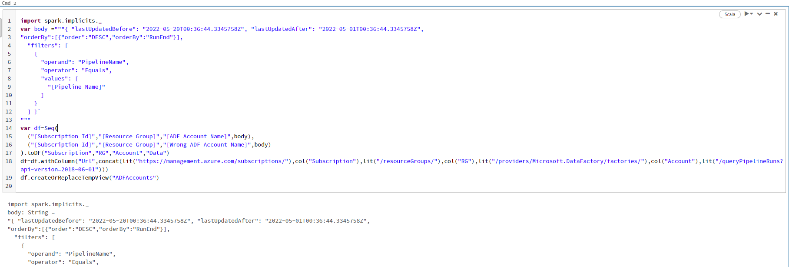
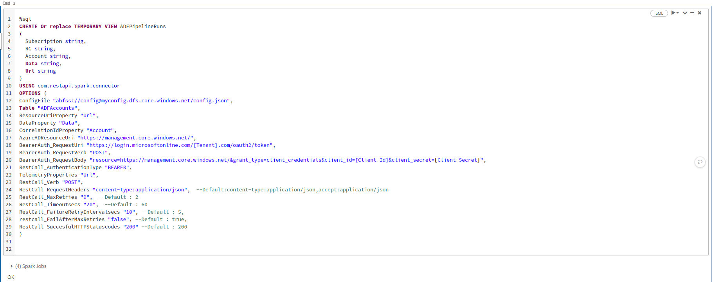
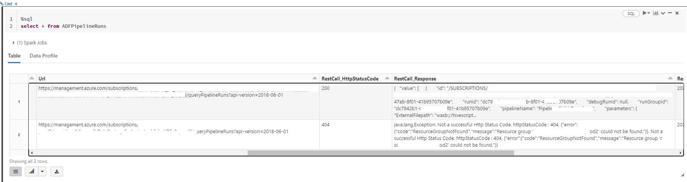

# Spark Rest Api Connector

There are various Apache spark connectors already available (Ex:- [sql-spark-connector](https://github.com/microsoft/sql-spark-connector)). Spark connectors help to connect to respective data sources either to read/query data and write data. 

Since [Apache Spark](https://spark.apache.org/) is distributed processing system and if the data sources have a well defined partitioning strategy, we ca build spark connectors which can efficiently read and write data to data sources. 

We can build spark connectors which may not be available with Spark libraries.

There isn't connector available to connect to remote rest api endpoint to download or upload data via spark. We are able to build a custom connector to talk to remote rest api endpoint supporting verbs GET/POST/PUT.

The connector expects to pass table name or location to create a dataframe. Each row in dataframe is expected to have the end point uri to invoke and connector internally makes parallel calls based on properties mentioned. Once connector make the rest call, the details of the response a new dataframe is constructed cloning the input dataframe and adding extra columns with rest api response details.

Below is an example using bearer authentication calling Azure ADF Rest Api to [query pipeline runs](https://docs.microsoft.com/en-us/rest/api/datafactory/pipeline-runs/query-by-factory) within a time range and specific to a pipeline.

Added 2 rows to the static dataframe, one with a valid ADF Account and other ones which doesnt exist.

Step 1 :
Constructing a static dataframe with details like azure subscription id, resource group, azure adf account,query pipeline runs body.
Registering the static dataframe as temp view  "ADFAccounts"

Step 2 :
Creating a temp view using the custom rest api connector (com.restapi.spark.connector)
Connector property (RestCall_FailAfterMaxRetries) is set as "False", hence for the invalid row expecting the appropriate rest response and http status code is added in the output dataframe without failing the query.

Step 3 :
Querying the above created temp view, which should make calls to the ADF account and download the response based on the body and other properties specified for connector.

