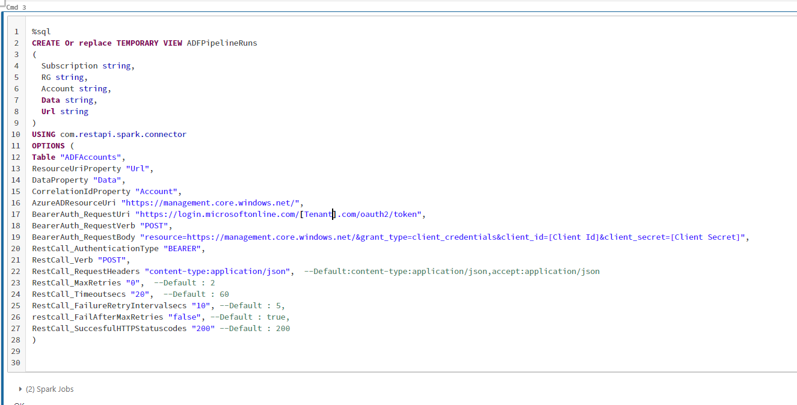

# Spark Rest Api Connector

There are various Apache spark connectors already available (Ex:- [sql-spark-connector](https://github.com/microsoft/sql-spark-connector)). Spark connectors help to connect to respective data sources either to read/query data and write data. 

Since [Apache Spark](https://spark.apache.org/) is distributed processing system and if the data sources have a well defined partitioning strategy, we ca build spark connectors which can efficiently read and write data to data sources. 

We can build spark connectors which may not be available with Spark libraries.

There isn't connector available to connect to remote rest api endpoint to download or upload data via spark. We are able to build a custom connector to talk to remote rest api endpoint supporting verbs GET/POST/PUT.

The connector expects to pass table name or location to create a dataframe. Each row in dataframe is expected to have the end point uri to invoke and connector internally makes parallel calls based on properties mentioned. Once connector make the rest call, the details of the response are added to a new dataframe which is constructed by cloning the input dataframe.

## Rest API Connector Properties

Below table is listed of supported properties which can be sent to rest api connector. Some of the properties are mandatory and few have a default value if not specified.

|Option|Purpose|
|------|-------|
|Table|Table name which can be resolved to read all the data.|
|Location| If the data has to be read from file system but not table, need to specify the path|
|Path|If Location is specified, then need to specify format, if format other than 'Parquet'.|
|ResourceUriProperty|Column in input data frame which has the "GET" Url to fetch the relevant payload|.
|CorrelationIdProperty|Column in input data frame which is used as a correlation to associate the download content from "GET" Url. This will be used for any troubleshooting purposes later.|.
|Configfile|Sensitive information such as Passwords, Access Keys, etc are specified in a config file which can be resolved in Spark cluster.|
|RestCall_AuthenticationType|Value should be either 'BEARER' or 'BASIC'. Default Value : 'BEARER'. Incase of 'BEARER' ensure to provide options  **BearerAuth_RequestUrl, BearerAuth_RequestHeaders, BearerAuth_RequestVerb, BearerAuth_RequestBody**. Incase of 'BASIC' ensure to provide options  **BasicAuth_UserName, BasicAuth_Password**.|
|BearerAuth_RequestUri|Incase of Bearer Token Authentication, please provide the Url to request the bearer token.|
|BearerAuth_RequestHeaders|Incase of Bearer Token Authentication, please provide the request headers that are to be sent while calling token url. Note : If there is sensitive to be sent in headers, it should be configured in the ConfigFile. Example :- accept:content/json;content-type:application/json|
|BearerAuth_RequestVerb|Incase of Bearer Token Authentication, please specify the type of the request call. Default value is POST.|
|BearerAuth_RequestBody|Incase of Bearer Token Authentication and Request is POST, please specify the body to be posted to the token url. Note :  If there is sensitive to be sent in body, it should be configured in the ConfigFile|
|BasicAuth_UserName|Incase of Basic Authentication, please provide the username.|
|BasicAuth_Password|Incase of Basic Authentication, please provide the password. Note : Since password is sensitive, it can be configured in the ConfigFile|
|RestCall_Timeoutsecs|Since component does "GET" calls, if there is no response within the specified time in seconds, it considers the call as timeout.|
|RestCall_FailAfterMaxRetries|Indicates whether if to fail the step if there are any failures even after reaching max retries while invoking the REST API. Default Value : true|
|RestCall_MaxRetries| Incase if there is a failure while calling "GET" or timeout, component will do multiple retries based on the specified value.|
|RestCall_FailureRetryIntervalsecs| During failure retries, component does a sleep  between retries based on the value specified.|
|RestCall_RequestHeaders| While calling the REST API, headers will be included in the request based on this parameter. If there is no value specified then defaults to "accept:content/json;content-type:application/json". Note : If there is sensitive to be sent in headers, it should be configured in the ConfigFile. Example :- accept:content/json;content-type:application/json|
|RestCall_MaxParallelCalls|While calling the REST API, the number of concurrent calls can be controlled with this value. Default value is 20.|
|RestCall_Verb| While calling the REST API, specified verb will be considered. Ex:- POST, GET. If there is no value specified then defaults to "GET".|
|RestCall_SuccesfulHttpStatusCodes| Post REST API call, will check if the response status code is matching with codes provided to consider as a successful http rest api call. Default Value : 200.|
|DataProperty| For PUT/POST REST API, need to specify the column available in the input table which is read and posted to the REST API for each row.|

## Bearer Authentication Example

Below is an example using bearer authentication calling Azure ADF Rest Api to [query pipeline runs](https://docs.microsoft.com/en-us/rest/api/datafactory/pipeline-runs/query-by-factory) within a time range and specific to a pipeline.

Added 2 rows to the static dataframe, one with a valid ADF Account and other ones which doesnt exist.

Step 1 :
Constructing a static dataframe with details like azure subscription id, resource group, azure adf account,query pipeline runs body.
Registering the static dataframe as temp view  "ADFAccounts"

Step 2 :
Creating a temp view using the custom rest api connector (com.restapi.spark.connector)
Connector property (RestCall_FailAfterMaxRetries) is set as "False", hence for the invalid row expecting the appropriate rest response and http status code is added in the output dataframe without failing the query.

Step 3 :
Querying the above created temp view, which should make calls to the ADF account and download the response based on the body and other properties specified for connector.

## Basic Authentication Example

Test cases are written for basic authentication, please follow [here](src/test/scala/com/restapi/spark/connector/BasicAuthTests.scala).
